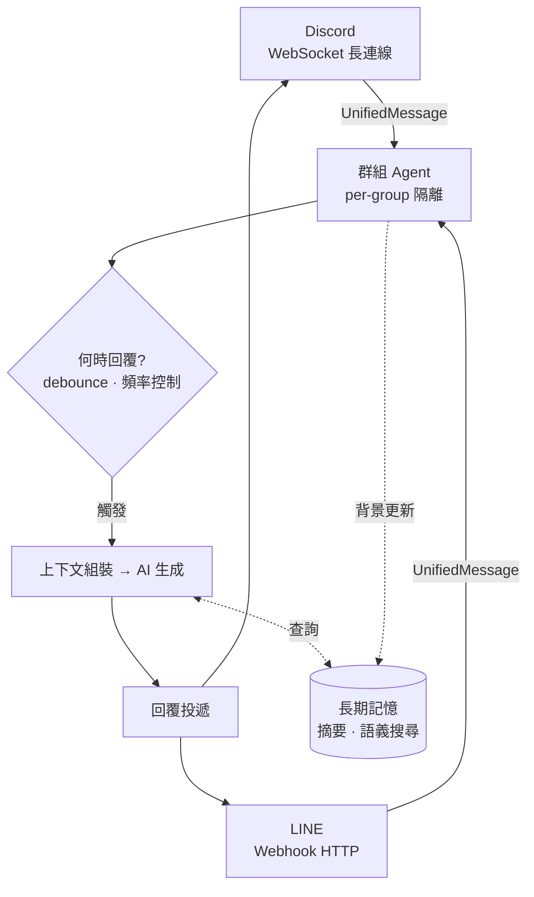

# yamada (山田)

山田——群組裡那個不知道什麼時候加進來的成員。她會聽大家聊天，等到適當的時候自然地插一句話。不是助手，不是機器人，就是個一直在群裡的人。

## 特色

- **Debounce 回覆** — 等大家說完才回，不會逐句搶話。靜默觸發、溢出觸發、@mention 急迫模式
- **長期記憶** — 背景壓縮對話為使用者/群組摘要 + 語義搜尋歷史訊息
- **Per-group 隔離** — 訊息、摘要、向量搜尋完全按群組隔離
- **雙平台** — Discord + LINE，統一訊息格式

## 架構



### 核心流程

1. **平台接入** — Discord / LINE 各自處理平台特有邏輯（連線、內容解析、mention 判定），轉為統一訊息格式
2. **群組路由** — 過濾 bot 訊息與 DM，路由到對應群組的 Agent（per-group 隔離）
3. **時機判斷** — Debounce 等大家說完再回；頻率控制避免刷屏
4. **上下文組裝** — 人格 + 記憶摘要 + 語義搜尋 + 近期訊息，控制 token 預算
5. **AI 生成回覆** — 可回覆、反應、或靜默跳過
6. **背景記憶** — 持續壓縮舊對話為摘要，建立語義索引供未來查詢

## 快速開始

本專案使用 [mise](https://mise.jdx.dev/) 管理工具版本與開發指令，[portless](https://github.com/vercel-labs/portless) 提供穩定的本地開發 URL。

```bash
mise install               # 安裝工具（bun 等）
bun install                # 安裝 npm 依賴
cp .env.example .env       # 編輯填入 token
mise run dev               # 啟動雙平台 → http://yamada.localhost:1355
```

> 查看所有可用指令：`mise tasks`

### 本地開發 URL

透過 portless，開發伺服器使用穩定的命名 URL 取代 port number：

| 指令                   | URL                            |
| ---------------------- | ------------------------------ |
| `mise run dev`         | `http://yamada.localhost:1355` |
| `mise run dev:line`    | `http://yamada.localhost:1355` |
| `mise run dev:discord` | `http://yamada.localhost:1355` |

portless proxy 會在首次執行 dev 指令時自動啟動，也可手動啟動：`portless proxy start`

### Cloudflare Tunnel（LINE Webhook 用）

Cloudflare Tunnel 提供公網 HTTPS，讓 LINE Webhook 可以送達本地開發伺服器：

```
LINE Platform → yamada-dev.maou.app → cloudflared → portless (1355) → app
```

設定步驟：

1. 安裝 [cloudflared](https://developers.cloudflare.com/cloudflare-one/connections/connect-networks/downloads/)
2. 建立 Tunnel 並設定 `~/.cloudflared/config.yml`（指向 `localhost:1355`，Host header 覆蓋為 `yamada.localhost`）
3. 啟動 tunnel：`cloudflared tunnel run <tunnel-name>`
4. LINE Webhook URL 設為 `https://yamada-dev.maou.app/webhook/line`

### Docker（生產用）

透過 Docker 部署，不經過 portless（直接使用固定 port）。

```bash
cp .env.example .env   # 編輯填入 token（含 TUNNEL_TOKEN）
docker compose up      # 啟動（首次會自動 build）
```

## 環境變數

所有設定皆透過環境變數（`.env`）提供，由 Zod schema 驗證並填入預設值。

> ⚡ Discord 和 LINE 為可選平台，**至少需設定一個**。同一平台的欄位必須成對出現。

### 秘密憑證

| 變數                        | 必要 | 說明                                                       |
| --------------------------- | ---- | ---------------------------------------------------------- |
| `DISCORD_TOKEN`             | ⚡   | Discord Bot Token                                          |
| `DISCORD_CLIENT_ID`         | ⚡   | Discord Application ID                                     |
| `LINE_CHANNEL_SECRET`       | ⚡   | LINE Channel Secret                                        |
| `LINE_CHANNEL_ACCESS_TOKEN` | ⚡   | LINE Channel Access Token                                  |
| `OPENAI_API_KEY`            |      | OpenAI API Key（不設定則 SDK 自動讀取 env var）            |
| `OPENAI_BASE_URL`           |      | OpenAI 自訂端點（不設定則使用官方預設）                    |
| `ANTHROPIC_API_KEY`         |      | Anthropic API Key（不設定則 SDK 自動讀取 env var）         |
| `ANTHROPIC_BASE_URL`        |      | Anthropic 自訂端點（不設定則使用官方預設）                 |
| `GOOGLE_API_KEY`            |      | Google AI Studio API Key（不設定則 SDK 自動讀取 env var）  |
| `GOOGLE_BASE_URL`           |      | Google AI Studio 自訂端點（不設定則使用官方預設）          |
| `OPENROUTER_API_KEY`        |      | OpenRouter API Key                                         |
| `OPENROUTER_BASE_URL`       |      | OpenRouter 自訂端點（預設 `https://openrouter.ai/api/v1`） |
| `OPENCODE_API_KEY`          |      | OpenCode Zen API Key                                       |
| `OPENCODE_BASE_URL`         |      | OpenCode Zen 自訂端點（預設 `https://opencode.ai/zen/v1`） |
| `TUNNEL_TOKEN`              |      | Cloudflare Tunnel Token（Docker Compose 用）               |
| `TUNNEL_TOKEN`              |      | Cloudflare Tunnel Token（Docker Compose 用）               |

### 人格與基本設定

| 變數                    | 預設值           | 說明                                                     |
| ----------------------- | ---------------- | -------------------------------------------------------- |
| `SOUL`                  | （內建人格）     | Bot 人格 system prompt                                   |
| `DB_DIR`                | `./data/groups/` | 群組 SQLite 資料庫目錄，每個群組一個 `{groupId}.db` 檔案 |
| `DISCORD_GROUP_ID_MODE` | `guild`          | `guild` = 同 server 共用 / `channel` = 每頻道獨立        |
| `LINE_WEBHOOK_PORT`     | `3000`           | LINE Webhook 監聽埠                                      |

### AI 模型

模型 ID 格式：`provider/model-name`（例如 `openai/gpt-5`、`openrouter/deepseek/deepseek-v3.2`）。
支援逗號分隔的多模型 fallback，依序嘗試直到成功。

| 變數             | 預設值                                                            | 說明                        |
| ---------------- | ----------------------------------------------------------------- | --------------------------- |
| `CHAT_MODEL`     | `openrouter/x-ai/grok-4.1-fast,openrouter/deepseek/deepseek-v3.2` | 聊天模型（逗號 = fallback） |
| `OBSERVER_MODEL` | 同 `CHAT_MODEL`                                                   | Observer 摘要壓縮用模型     |

**支援的 provider 與 API 設定：**

| Provider       | 預設端點                       | 設定欄位                                     |
| -------------- | ------------------------------ | -------------------------------------------- |
| `openai`       | OpenAI 官方                    | `OPENAI_API_KEY` / `OPENAI_BASE_URL`         |
| `anthropic`    | Anthropic 官方                 | `ANTHROPIC_API_KEY` / `ANTHROPIC_BASE_URL`   |
| `google`       | Google AI Studio               | `GOOGLE_API_KEY` / `GOOGLE_BASE_URL`         |
| `openrouter`   | `https://openrouter.ai/api/v1` | `OPENROUTER_API_KEY` / `OPENROUTER_BASE_URL` |
| `opencode-zen` | `https://opencode.ai/zen/v1`   | `OPENCODE_API_KEY` / `OPENCODE_BASE_URL`     |

### Embedding

Embedding 使用與聊天模型相同的 provider API 設定，無獨立懑證。

| 變數                   | 預設值                          | 說明                         |
| ---------------------- | ------------------------------- | ---------------------------- |
| `EMBEDDING_MODEL`      | `openai/text-embedding-3-small` | Embedding 模型 ID            |
| `EMBEDDING_DIMENSIONS` | `1536`                          | 向量維度（需與模型輸出一致） |

### Debounce — 控制何時觸發 AI 回覆

| 變數                      | 預設值  | 說明                                             |
| ------------------------- | ------- | ------------------------------------------------ |
| `DEBOUNCE_SILENCE_MS`     | `15000` | 靜默觸發：最後一則訊息後 N ms 無新訊息即觸發     |
| `DEBOUNCE_URGENT_MS`      | `2000`  | @mention 急迫模式：被 mention 時改用較短等待時間 |
| `DEBOUNCE_OVERFLOW_CHARS` | `3000`  | 溢出觸發：buffer 累積字元超過此值即立刻觸發      |

### Frequency — 回應頻率控制

| 變數                             | 預設値 | 說明                               |
| -------------------------------- | ------ | ---------------------------------- |
| `FREQUENCY_ENABLED`              | `true` | 頻率控制器總開關                   |
| `FREQUENCY_LONG_HALFLIFE_HOURS`  | `120`  | 長期 EMA 半衰期（小時），預設 5 天 |
| `FREQUENCY_SHORT_HALFLIFE_HOURS` | `4`    | 短期 EMA 半衰期（小時），防止連發  |
| `FREQUENCY_ACTIVE_WINDOW_DAYS`   | `7`    | 計算活躍人數的時間窗口（天）       |

### Context — 控制送給 AI 的上下文內容

| 變數                           | 預設值 | 說明                                  |
| ------------------------------ | ------ | ------------------------------------- |
| `CONTEXT_MAX_TOKENS`           | `4000` | system prompt + 摘要的 token 預算上限 |
| `CONTEXT_SEMANTIC_TOP_K`       | `5`    | 語義搜尋回傳的最大筆數                |
| `CONTEXT_SEMANTIC_THRESHOLD`   | `0.7`  | 語義搜尋距離閾值（0~2，越小越嚴格）   |
| `CONTEXT_RECENT_MESSAGE_COUNT` | `20`   | 從 DB 取近期訊息的筆數                |
| `CONTEXT_TOKEN_ESTIMATE_RATIO` | `3`    | token 估算比率：每 N 字元約為 1 token |
| `CHUNK_TOKEN_LIMIT`            | `500`  | Chunk 分割的 token 上限               |
| `CONTEXT_FACT_TOP_K`           | `5`    | 語義搜尋回傳的最大 facts 筆數         |
| `CONTEXT_FACT_THRESHOLD`       | `0.7`  | 語義搜尋距離閾值（0~2，越小越嚴格）   |
| `FACT_CONFIDENCE_THRESHOLD`    | `0.5`  | 注入 context 的最低 confidence        |
| `FACT_MAX_PINNED`              | `4`    | 每位用戶 pinned facts 上限            |

### Observer — 背景記憶壓縮

| 變數                          | 預設值 | 說明                                |
| ----------------------------- | ------ | ----------------------------------- |
| `OBSERVER_MESSAGE_THRESHOLD`  | `50`   | 累積多少則訊息才觸發新一輪壓縮      |
| `OBSERVER_USER_MESSAGE_LIMIT` | `50`   | 壓縮用戶摘要時取最近 N 則該用戶訊息 |

### Delivery — 訊息投遞與平台限制

| 變數                                | 預設值             | 說明                                                               |
| ----------------------------------- | ------------------ | ------------------------------------------------------------------ |
| `DELIVERY_DISCORD_MAX_LENGTH`       | `2000`             | Discord 單則訊息字元上限                                           |
| `DELIVERY_LINE_MAX_LENGTH`          | `5000`             | LINE 單則訊息字元上限                                              |
| `DELIVERY_DM_REPLY_TEXT`            | `暫不支援私訊功能` | 私訊時的自動回覆文字                                               |
| `DELIVERY_REPLY_TOKEN_FRESHNESS_MS` | `50000`            | LINE replyToken 有效時間（ms）；實際 TTL ~60s，預設 50s 為安全邊際 |

### Bot 身份

| 變數            | 預設值 | 說明                      |
| --------------- | ------ | ------------------------- |
| `BOT_USER_ID`   | `bot`  | Bot 的 userId（用於 DB）  |
| `BOT_USER_NAME` | `Bot`  | Bot 的顯示名稱（用於 DB） |

### Logging — 日誌輪替

| 變數                     | 預設值   | 說明                 |
| ------------------------ | -------- | -------------------- |
| `LOG_DIR`                | `./logs` | 日誌檔案輸出目錄     |
| `LOG_ROTATION_FREQUENCY` | `daily`  | 輪替頻率             |
| `LOG_MAX_SIZE`           | `100M`   | 單一日誌檔案大小上限 |
| `LOG_MAX_RETENTION`      | `30d`    | 日誌最大保留時間     |

### Shutdown — Agent 關閉行為

| 變數                        | 預設值  | 說明                                  |
| --------------------------- | ------- | ------------------------------------- |
| `SHUTDOWN_TIMEOUT_MS`       | `30000` | 等待 AI pipeline 完成的最大時間（ms） |
| `SHUTDOWN_POLL_INTERVAL_MS` | `100`   | 輪詢 isProcessing 狀態的間隔（ms）    |

## 平台設定

### Discord

1. [Developer Portal](https://discord.com/developers/applications) 建立 Application
2. Bot → 啟用 **Message Content Intent**
3. OAuth2 → `bot` scope → 權限：Send Messages、Add Reactions、Read Message History
4. 邀請 bot 到 server

### LINE

1. [Developers Console](https://developers.line.biz/) 建立 Messaging API channel
2. 取得 Channel Secret 和 Access Token
3. Webhook URL：`https://<domain>:3000/webhook/line`
4. 關閉自動回覆

## 測試追蹤代號

整合測試依功能分類，每組以代號追蹤：

| 代號          | 名稱                  | 測試檔案                                       | 說明                                        |
| ------------- | --------------------- | ---------------------------------------------- | ------------------------------------------- |
| T1-CHAIN      | End-to-end Chain      | `src/__tests__/integration/chain.spec.ts`      | 完整流程：訊息進入 → 觸發 → AI 回覆 → 投遞  |
| T2-TRIGGER    | Trigger State Machine | `src/__tests__/integration/chain.spec.ts`      | Debounce 觸發機制：sticky mention、字元累積 |
| T3-ISOLATE    | Group Isolation       | `src/__tests__/integration/isolation.spec.ts`  | Per-group 隔離：跨群組不互相污染            |
| T4-RESILIENCE | Error Resilience      | `src/__tests__/integration/resilience.spec.ts` | 錯誤恢復：各層失敗不影響整體穩定性          |
| T5-LINE-EDGE  | LINE Edge Cases       | `src/line/channel.spec.ts`                     | LINE 特殊訊息類型與 edge case               |
