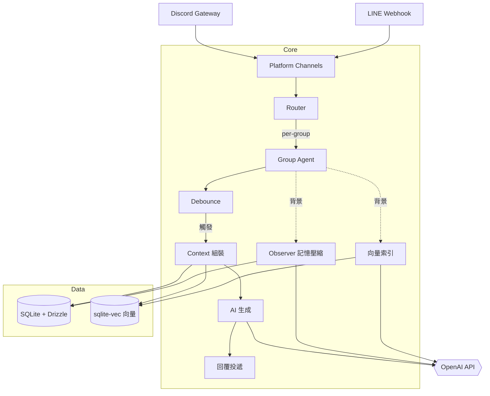

# yamada (山田)

山田——群組裡那個不知道什麼時候加進來的成員。她會聽大家聊天，等到適當的時候自然地插一句話。不是助手，不是機器人，就是個一直在群裡的人。

## 特色

- **Debounce 回覆** — 等大家說完才回，不會逐句搶話。靜默觸發、溢出觸發、@mention 急迫模式
- **長期記憶** — 背景壓縮對話為使用者/群組摘要 + 語義搜尋歷史訊息
- **Per-group 隔離** — 訊息、摘要、向量搜尋完全按群組隔離
- **雙平台** — Discord + LINE，統一訊息格式

## 架構



### 核心流程

1. **訊息進入** — Discord/LINE Channel 轉換為統一格式
2. **路由** — Router 過濾 bot 訊息、拒絕 DM、路由到對應群組的 Agent
3. **Debounce** — 等待靜默(秒) / 溢出N字 / @mention 盡快觸發
4. **Context 組裝** — SOUL 人格 + 群組摘要 + 使用者摘要 + 語義搜尋 + 近期訊息，控制 token 預算
5. **AI 生成** — Vercel AI SDK 呼叫，回覆經平台長度截斷後送出
6. **背景任務** — Observer 壓縮舊對話為摘要、Embedding 建立向量索引

## 快速開始

```bash
bun install
cp .env.example .env   # 編輯填入 token
bun run src/index.ts
```

## 環境變數

所有設定皆透過環境變數（`.env`）提供，由 Zod schema 驗證並填入預設值。

> ⚡ Discord 和 LINE 為可選平台，**至少需設定一個**。同一平台的欄位必須成對出現。

### 秘密憑證

| 變數                        | 必要 | 說明                                                       |
| --------------------------- | ---- | ---------------------------------------------------------- |
| `DISCORD_TOKEN`             | ⚡   | Discord Bot Token                                          |
| `DISCORD_CLIENT_ID`         | ⚡   | Discord Application ID                                     |
| `LINE_CHANNEL_SECRET`       | ⚡   | LINE Channel Secret                                        |
| `LINE_CHANNEL_ACCESS_TOKEN` | ⚡   | LINE Channel Access Token                                  |
| `AI_BASE_URL`               |      | 自訂 OpenAI 相容端點 URL（不設定則使用預設 OpenAI）        |
| `AI_API_KEY`                |      | 自訂端點 API Key（不設定則 fallback OPENAI_API_KEY）       |
| `EMBEDDING_BASE_URL`        |      | Embedding 專用端點 URL（不設定則 fallback 到 AI_BASE_URL） |
| `EMBEDDING_API_KEY`         |      | Embedding 專用 API Key（不設定則 fallback 到 AI_API_KEY）  |

### 人格與基本設定

| 變數                    | 預設值           | 說明                                                     |
| ----------------------- | ---------------- | -------------------------------------------------------- |
| `SOUL`                  | （內建人格）     | Bot 人格 system prompt                                   |
| `DB_DIR`                | `./data/groups/` | 群組 SQLite 資料庫目錄，每個群組一個 `{groupId}.db` 檔案 |
| `DISCORD_GROUP_ID_MODE` | `guild`          | `guild` = 同 server 共用 / `channel` = 每頻道獨立        |
| `LINE_WEBHOOK_PORT`     | `3000`           | LINE Webhook 監聽埠                                      |

### AI 模型

| 變數             | 預設值        | 說明                                   |
| ---------------- | ------------- | -------------------------------------- |
| `AI_PROVIDER`    | `openai`      | AI provider 名稱（對應 Vercel AI SDK） |
| `AI_MODEL`       | `gpt-4o-mini` | 對話生成模型 ID                        |
| `OBSERVER_MODEL` | `gpt-4o-mini` | Observer 摘要壓縮用的模型 ID           |

### Embedding

| 變數                   | 預設值                   | 說明                         |
| ---------------------- | ------------------------ | ---------------------------- |
| `EMBEDDING_MODEL`      | `text-embedding-3-small` | Embedding 模型 ID            |
| `EMBEDDING_DIMENSIONS` | `1536`                   | 向量維度（需與模型輸出一致） |

### Debounce — 控制何時觸發 AI 回覆

| 變數                      | 預設值  | 說明                                             |
| ------------------------- | ------- | ------------------------------------------------ |
| `DEBOUNCE_SILENCE_MS`     | `15000` | 靜默觸發：最後一則訊息後 N ms 無新訊息即觸發     |
| `DEBOUNCE_URGENT_MS`      | `2000`  | @mention 急迫模式：被 mention 時改用較短等待時間 |
| `DEBOUNCE_OVERFLOW_CHARS` | `3000`  | 溢出觸發：buffer 累積字元超過此值即立刻觸發      |

### Context — 控制送給 AI 的上下文內容

| 變數                           | 預設值 | 說明                                  |
| ------------------------------ | ------ | ------------------------------------- |
| `CONTEXT_MAX_TOKENS`           | `4000` | system prompt + 摘要的 token 預算上限 |
| `CONTEXT_SEMANTIC_TOP_K`       | `5`    | 語義搜尋回傳的最大筆數                |
| `CONTEXT_SEMANTIC_THRESHOLD`   | `0.7`  | 語義搜尋距離閾值（0~2，越小越嚴格）   |
| `CONTEXT_RECENT_MESSAGE_COUNT` | `20`   | 從 DB 取近期訊息的筆數                |
| `CONTEXT_TOKEN_ESTIMATE_RATIO` | `3`    | token 估算比率：每 N 字元約為 1 token |

### Observer — 背景記憶壓縮

| 變數                          | 預設值 | 說明                                |
| ----------------------------- | ------ | ----------------------------------- |
| `OBSERVER_MESSAGE_THRESHOLD`  | `50`   | 累積多少則訊息才觸發新一輪壓縮      |
| `OBSERVER_USER_MESSAGE_LIMIT` | `50`   | 壓縮用戶摘要時取最近 N 則該用戶訊息 |

### Delivery — 訊息投遞與平台限制

| 變數                                | 預設值             | 說明                                                               |
| ----------------------------------- | ------------------ | ------------------------------------------------------------------ |
| `DELIVERY_DISCORD_MAX_LENGTH`       | `2000`             | Discord 單則訊息字元上限                                           |
| `DELIVERY_LINE_MAX_LENGTH`          | `5000`             | LINE 單則訊息字元上限                                              |
| `DELIVERY_DM_REPLY_TEXT`            | `暫不支援私訊功能` | 私訊時的自動回覆文字                                               |
| `DELIVERY_REPLY_TOKEN_FRESHNESS_MS` | `50000`            | LINE replyToken 有效時間（ms）；實際 TTL ~60s，預設 50s 為安全邊際 |

### Bot 身份

| 變數            | 預設值 | 說明                      |
| --------------- | ------ | ------------------------- |
| `BOT_USER_ID`   | `bot`  | Bot 的 userId（用於 DB）  |
| `BOT_USER_NAME` | `Bot`  | Bot 的顯示名稱（用於 DB） |

### Logging — 日誌輪替

| 變數                     | 預設值   | 說明                 |
| ------------------------ | -------- | -------------------- |
| `LOG_DIR`                | `./logs` | 日誌檔案輸出目錄     |
| `LOG_ROTATION_FREQUENCY` | `daily`  | 輪替頻率             |
| `LOG_MAX_SIZE`           | `100M`   | 單一日誌檔案大小上限 |
| `LOG_MAX_RETENTION`      | `30d`    | 日誌最大保留時間     |

### Shutdown — Agent 關閉行為

| 變數                        | 預設值  | 說明                                  |
| --------------------------- | ------- | ------------------------------------- |
| `SHUTDOWN_TIMEOUT_MS`       | `30000` | 等待 AI pipeline 完成的最大時間（ms） |
| `SHUTDOWN_POLL_INTERVAL_MS` | `100`   | 輪詢 isProcessing 狀態的間隔（ms）    |

## 平台設定

### Discord

1. [Developer Portal](https://discord.com/developers/applications) 建立 Application
2. Bot → 啟用 **Message Content Intent**
3. OAuth2 → `bot` scope → 權限：Send Messages、Add Reactions、Read Message History
4. 邀請 bot 到 server

### LINE

1. [Developers Console](https://developers.line.biz/) 建立 Messaging API channel
2. 取得 Channel Secret 和 Access Token
3. Webhook URL：`https://<domain>:3000/webhook/line`
4. 關閉自動回覆
